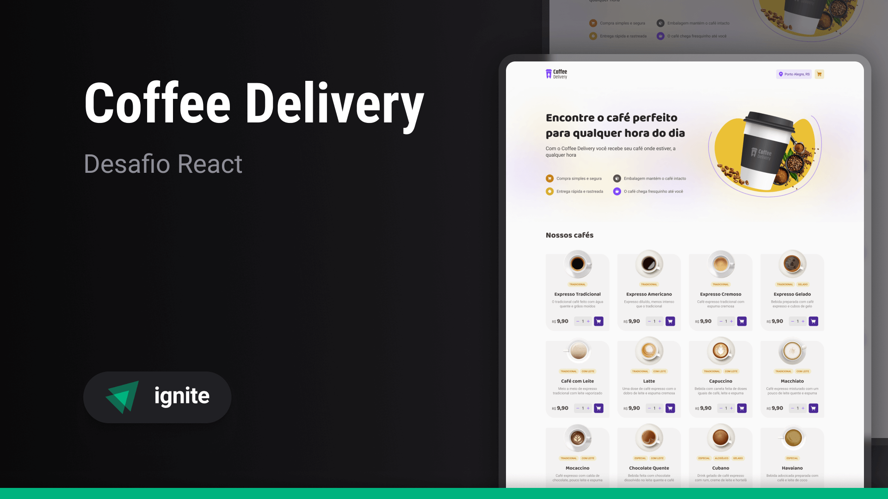

> Ignite - Desafio #2

# Coffee Delivery

## Sobre o desafio

O desafio consiste em desenvolver uma aplicação para gerenciar um carrinho de compras de uma cafeteria fictícia, que contém as seguintes funcionalidades:

- Listagem de produtos (cafés) disponíveis para compra
- Adicionar uma quantidade específicas de itens no carrinho
- Aumentar ou diminuir a quantidade de itens no carrinho
- Formulário para o usuário preencher o seu endereço
- Exibir o total de itens no carrinho no header
- Exibir o valor total da soma de itens no carrinho multiplicados pelo valor
- Exibir dados do usuário na página de sucesso

## O que foi usado

- React
- TypeScript
- Vite
- Tailwind
- Tailwind-Variants
- React Router
- React Hook Form
- Zod
- Eslint
- Prettier
- Json-server

> O desafio original não inclui Tailwind, Eslint e Prettier
